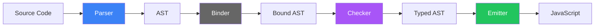

# TSKaigi Hokurikuで<br>LT登壇してきた話

中村崇人

<div class="abs-br m-6 flex gap-2">
  <a href="https://github.com/aTakatoNakamura" target="_blank" alt="GitHub" title="Open in GitHub"
    class="text-xl slidev-icon-btn opacity-50 !border-none !hover:text-white">
    <carbon-logo-github />
  </a>
</div>

---
layout: center
---

# 自己紹介

<div class="grid grid-cols-[1fr_2fr] gap-8 items-center">

<div class="text-center">


### 中村崇人

</div>

<div class="text-left">

-  **所属**: [IoT開発本部ソリューション開発2部2課]
-  **趣味**: アマチュアオーケストラでバイオリン🎻弾いてます。  
  2月に[演奏会](https://teket.jp/8191/58877)があるので、ご興味あれば是非
-  **家族**: 先月娘が生まれて妻と子供二人の4人家族になりました

</div>

</div>

---

# TSKaigi Hokuriku

<div>

TSKaigi は、「学び、繋がり、”型”を破ろう」をミッションに TypeScript に関するテーマを扱う日本最大級の技術カンファレンスの地方開催版

昨年、京都で開催されたTSKaigi Kansai 2024 に続き

今年は金沢で「[TSKaigi Hokuriku 2025](https://hokuriku.tskaigi.org/)」が開催されました。

そこでLTをしてきたのでその内容と、現地の様子の共有です


</div>

---
layout: center
class: text-center
---

# LTで話してきたこと

---

# パイプ演算子をTypeScriptに実装してみた話

## 動機

- 今年東京で開催されたTSKaigiでtsgoの話などを聞いてtscに興味が湧いた
- どうなってるのか知るためには拡張して遊んでみるのが理解が深まるかなと思って拡張してみることにした

---

# パイプ演算子とは

<div class="grid grid-cols-2 gap-8 mt-8">

<div>

### 従来の書き方

```ts
console.log(
  double(
    square(
      add(1, 2)
    )
  )
);
```

内側から実行されるので記述順と処理順が逆！

</div>

<div>

### パイプ演算子

```ts
1
  |> add(%, 2)
  |> square(%)
  |> double(%)
  |> console.log(%);
```

左から右へ、処理の流れがわかりやすい！

</div>

</div>

<div v-click class="mt-8 text-sm opacity-75">

💡 Stage 2の提案: https://github.com/tc39/proposal-pipeline-operator

</div>

---
layout: center
class: text-center
---

# TypeScriptの実行の仕組み

<div class="mt-8">

基本的には、TypeScriptは**JavaScriptに変換してから実行**される

</div>

<div class="mt-8 grid grid-cols-3 gap-4 text-sm">

<div class="p-4 bg-blue-500 bg-opacity-10 rounded">

### TypeScript

```ts
const x: number = 5;
```

</div>

<div class="flex items-center justify-center">

→   変換   →

</div>

<div class="p-4 bg-green-500 bg-opacity-10 rounded">

### JavaScript

```js
const x = 5;
```

</div>

</div>

<!--
して、このパイプ演算子をtsで動かしたいんですが、  

基本的に、TSは、JSに変換してから実行されます。

なのでパイプ演算子をTSに勝手に実装するには、変換の部分に手を加えることで実現できます。

-->

---
layout: center
---

# TypeScriptコンパイラの構造をざっくりと

<div class="grid grid-cols-3 gap-4 mt-8">

<div v-click class="p-6 bg-blue-500 bg-opacity-10 rounded">

### 1️⃣ Parser

**入力**: ソースコード  
**出力**: AST

トークン分割 → 構文解析

<div class="text-xs mt-4 opacity-75">
scanner.ts, parser.ts
</div>

</div>

<div v-click class="p-6 bg-purple-500 bg-opacity-10 rounded">

### 2️⃣ Checker

**入力**: AST  
**出力**: 型情報付きAST

型推論・型チェック

<div class="text-xs mt-4 opacity-75">
checker.ts
</div>

</div>

<div v-click class="p-6 bg-green-500 bg-opacity-10 rounded">

### 3️⃣ Emitter

**入力**: AST  
**出力**: JavaScript

コード生成

<div class="text-xs mt-4 opacity-75">
emitter.ts
</div>

</div>

</div>

<div class="mt-8 text-center">



<div class="text-xs mt-2 opacity-60">
今回修正したのは主に Parser, Checker, Emitter の3つ
</div>

</div>

<!--
ということでtscを見ていくんですが

TSはざっくりこのような過程を辿ってjsになります。

まず、Parserがtsのソースコードを構文解析し、ASTを作ります。

次に、Binderでバインドするんですが、今回のパイプ演算子では特にいじってないので飛ばします。

そして、CheckerがASTを受け取って型推論と型チェックを行い、
型情報を付けたASTを出力します。

最後に、EmitterがASTを受け取ってJavaScriptコードを生成します。

今回パイプ演算子を実装するために修正したのは、Parser、Checker、Emitterの3つです。
-->

---
---

# 今回実装したバージョン

シンプルな `|>` 演算子

```ts
function double(x: number): number {
  return x * 2;
}

function square(x: number): number {
  return x * x;
}

// シンプルなパイプ
const result1 = 5 |> double;  // → (double)(5)

// チェーン可能
const result2 = 5 |> square |> double;  // → (double)((square)(5))
```

<div class="mt-6 p-4 bg-orange-500 bg-opacity-10 rounded">

⚠️ 実験的実装：Hack Proposal版ではなく、最もシンプルな形で実装

</div>

<!--
今回は、最もシンプルなパイプ演算子を実装しました。
5 パイプ doubleは、doubleカッコ5というJavaScriptに変換されます。
チェーンも可能で、5 パイプ square パイプ double は、ネストした関数呼び出しに変換されます。
TC39のHack Proposal版ではなく、最もシンプルな形で実装しています。
-->

---
---

# ステップ1: パーサー

新しいトークンとASTノードの追加

````md magic-move {lines: true}
```ts
// types.ts - SyntaxKindに追加
export const enum SyntaxKind {
    // ...
    CommaToken
    // ...
    BarGreaterThanToken,  // |>
    // ...
    PipeExpression,       // パイプ式のAST
}
```

```ts
// scanner.ts - トークン認識
function scan(): SyntaxKind {
    // ...
    case CharacterCodes.bar:
        if (text.charCodeAt(pos + 1) === CharacterCodes.greaterThan) {
            return pos += 2, token = SyntaxKind.BarGreaterThanToken;
        }
    // ...
}
```

```ts
// parser.ts - AST構築
function parseBinaryExpressionOrHigher() {
    // ...
    case SyntaxKind.BarGreaterThanToken:
        return factory.createPipeExpression(
            leftOperand,
            operatorToken,
            rightOperand
        );
}
```
````

<!--
ステップ1はパーサーです。パーサーは3つのファイルを修正する必要があります。

まず、types.tsでSyntaxKindというenumに、新しいトークンとASTノードの種類を追加します。
BarGreaterThanTokenが縦棒と大なり記号のトークンで、PipeExpressionがパイプ式のASTノードです。

次に、scanner.tsでトークンを認識させます。
scan関数の中で、縦棒の文字を見つけたら、次の文字が大なり記号かチェックして、
そうならBarGreaterThanTokenを返します。

最後に、parser.tsでAST構築のロジックを追加します。
parseBinaryExpressionOrHigher関数の中で、BarGreaterThanTokenを見つけたら、
factory.createPipeExpressionを呼び出して、左辺、演算子、右辺の3つを渡してASTノードを作ります。

これでパーサーの実装は完了です。
-->

---
---

# ステップ2: チェッカー

型システムとの統合

```ts
function checkPipeExpression(node: PipeExpression): Type {
  // 左辺の型をチェック (例: 5 → number)
  const leftType = checkExpression(node.left);
  
  // 右辺の型をチェック (例: square → (number) => number)
  const rightType = checkExpression(node.right);
  
  // 本来は以下のチェックが必要:
  // - 右辺が関数型か？
  // - 左辺の型を右辺の引数として渡せるか？
  
  // 今回はシンプルに関数の戻り値の型を返す
  return rightType;
}
```

<!--
ステップ2はチェッカーです。チェッカーは型チェックを担当します。

checkPipeExpressionという関数を新しく作ります。
まず、左辺の型をチェックします。例えば5ならnumber型です。
次に、右辺の型をチェックします。例えばsquare関数なら、number を受け取ってnumberを返す関数型です。

本来なら、右辺が本当に関数型か、左辺の型を引数として渡せるか、といった詳細なチェックが必要ですが、
今回はシンプルに、関数の戻り値の型を返すだけにしています。

型の流れを見ると、5パイプsquareでは、numberがnumberを返す関数に渡されて、結果はnumberになります。
その結果がさらにdoubleに渡されて、最終的な型もnumberになります。

このように、チェッカーは型が正しく流れていくことを保証します。
-->

---
---

# ステップ3: エミッター

再帰的なコード生成

<div class="grid grid-cols-2 gap-6 mt-4">

<div>

```ts
function emitPipeExpression(
  node: PipeExpression
) {
  emit(node.right);
  write("(");
  
  // 左辺がPipeなら再帰
  if (node.left.kind === SyntaxKind.PipeExpression) {
    emitPipeExpression(
      node.left
    );
  } else {
    emit(node.left);
  }
  
  write(")");
}
```

</div>

<div>

### 変換の流れ

```
5 |> square |> double
```

<div class="mt-4 text-sm">

1. 外側の `|> double` を処理
2. `double(...)` を出力
3. 左辺 `5 |> square` を再帰処理
4. `square(5)` を出力
5. 結果: `double(square(5))`

</div>

</div>

</div>

<!--
ステップ3はエミッターです。エミッターはJavaScriptコードを生成します。

emitPipeExpression関数を作ります。
この関数は、パイプ式を「関数カッコ引数カッコ」という形に変換します。

まず、開きカッコを書いて、右辺の関数を出力します。
次に、閉じカッコと開きカッコを書きます。
そして、左辺を出力するのですが、ここがポイントです。

左辺がまたPipeExpressionなら、つまりチェーンされたパイプなら、
emitPipeExpression自身を再帰的に呼び出します。
そうでなければ、普通に左辺を出力します。
最後に閉じカッコを書きます。

例えば、5パイプsquareパイプdoubleの場合、
まず外側のdoubleを処理して、カッコdoubleカッコカッコと出力します。
次に、左辺の5パイプsquareを再帰的に処理して、カッコsquareカッコ5カッコカッコと出力します。
これで、カッコdoubleカッコカッコカッコsquareカッコ5カッコカッコカッコという、
正しくネストした関数呼び出しになります。

この再帰処理が、チェーンされたパイプを正しく変換する鍵でした。
-->


---

# 実際にコンパイルしてみる

<div class="grid grid-cols-2 gap-6">

<div>

### TypeScript

```ts
function square(x: number): number {
  return x * x;
}

function double(x: number): number {
  return x * 2;
}

const result = 5 |> square |> double;
console.log(result);
```

</div>

<div>

### JavaScript

```js
function square(x) {
  return x * x;
}

function double(x) {
  return x * 2;
}

const result = double(square(5));
console.log(result);
```

<div class="mt-4 text-sm opacity-75">

✨ パイプ演算子が関数呼び出しのネストに変換される

</div>

</div>

</div>

---

# 印象に残ったセッション①

## [TypeScript 6.0で非推奨化されるオプションたち](https://speakerdeck.com/uhyo/typescript-6-dot-0defei-tui-jiang-hua-sareruopusiyontati)

- TypeScriptのネイティブ版(tsgo)はバージョン7.0としてリリースされる見込みですが、それに向けて古い非推奨化されるオプションの話でした。
- 非推奨化以外にも挙動が変化するものにも触れられていて、アップデートするときに気をつけることがわかりました。

---

# 印象に残ったセッション②

## [TypeScript AST を活用した 設計差分抽出の紹介](https://speakerdeck.com/takewell/introduction-to-design-difference-extraction-using-typescript-asta)

- コードレビューの補助ツールとしてASTを活用して関数レベルの依存関係図やシーケンス図を生成できるようにしたという話
- 詳細は語られなかったので詳しくはわからなかったのですが、あったら便利そう

---

# 印象に残ったセッション③

## [フロントエンドにおける「型」の責務分離に対する1つのアプローチ](https://speakerdeck.com/kinocoboy2/hurontoendoniokeru-xing-noze-ren-fen-jie-nidui-suru1tunoapuroti)

- フロントエンドは、ユーザー（人間）とシステム（機械）という性質の異なる 2 つの要素をつなぐインターフェースで、そのため、本質的に二重性を抱えており、これが型の複雑さを生み出している。
- ユースケース駆動設計（Iconixプロセス）の観点でUI用の型をAPI用の型に変換する層を作る方法について説明していました。

---

# 会場の雰囲気

<div class="grid grid-cols-2 gap-1 mt-4 max-h-96">
  <div class="flex flex-col gap-1">
    
    
  </div>
  
</div>


---
layout: end
---

# まとめ

<div class="text-left max-w-3xl mx-auto">

<v-clicks>

- **TSKaigi Hokuriku 2025**で登壇してきました
  - パイプ演算子をTypeScriptに実装する話
  - Parser、Checker、Emitterの3ステップで実装
  
- **印象に残ったセッション**
  - TypeScript 6.0の非推奨化オプション
  - AST活用した設計差分抽出
  - フロントエンドの型の責務分離

</v-clicks>

<v-clicks>

そのほかの登壇資料などをまとめてくれている人がいたので気になる方はこちらもどうぞ  
[TSKaigi Hokuriku 2025 登壇資料・感想まとめ](https://zenn.dev/teamlab_fe/articles/8a96282a2d13d4#tskaigi-hokuriku-2025-%E7%99%BB%E5%A3%87%E8%B3%87%E6%96%99%E3%83%BB%E6%84%9F%E6%83%B3%E3%81%BE%E3%81%A8%E3%82%81)

</v-clicks>

</div>

---
layout: end
---

# ありがとうございました！
